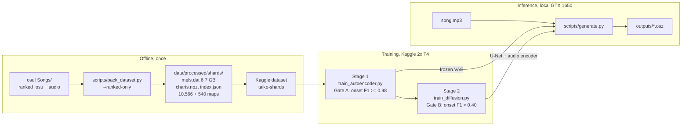
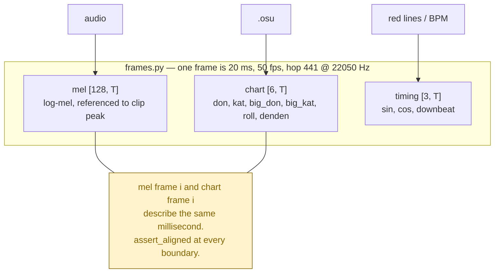
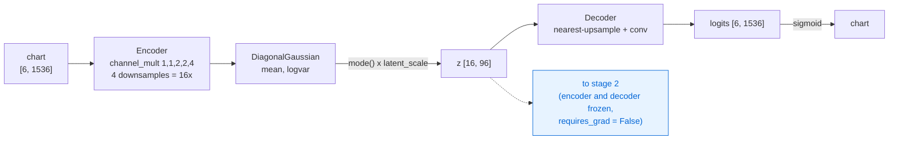
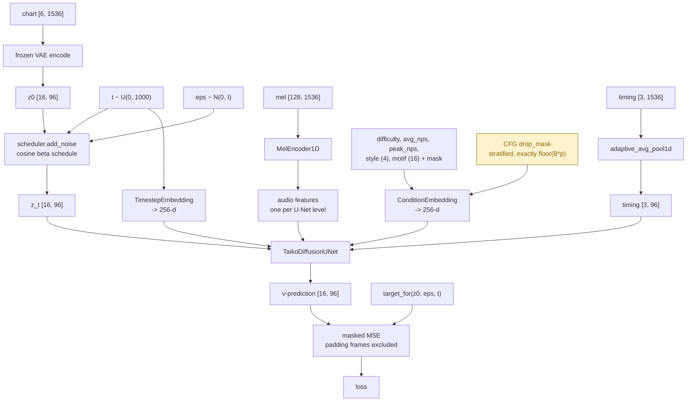
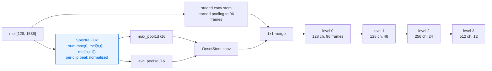
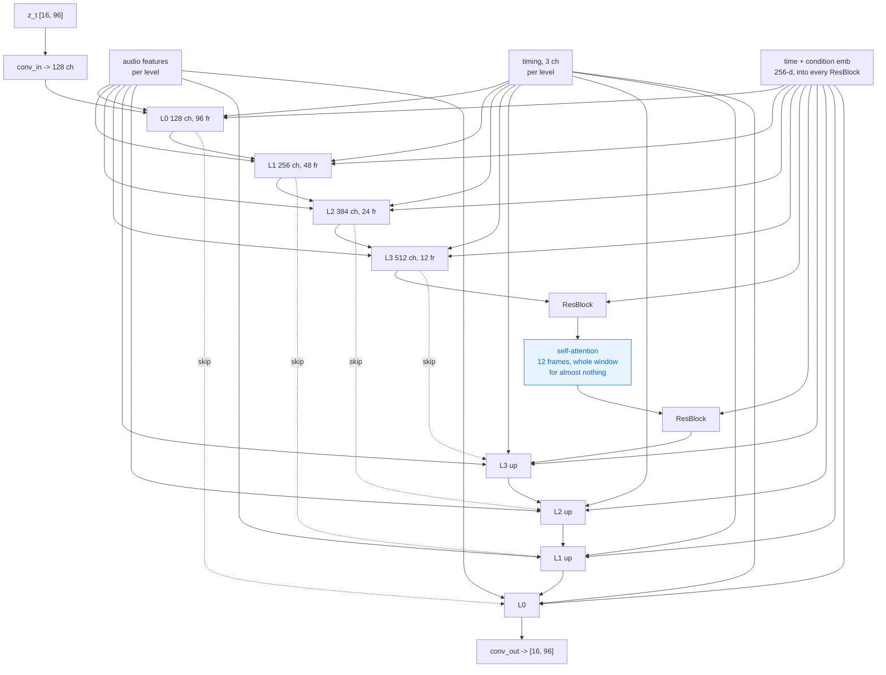
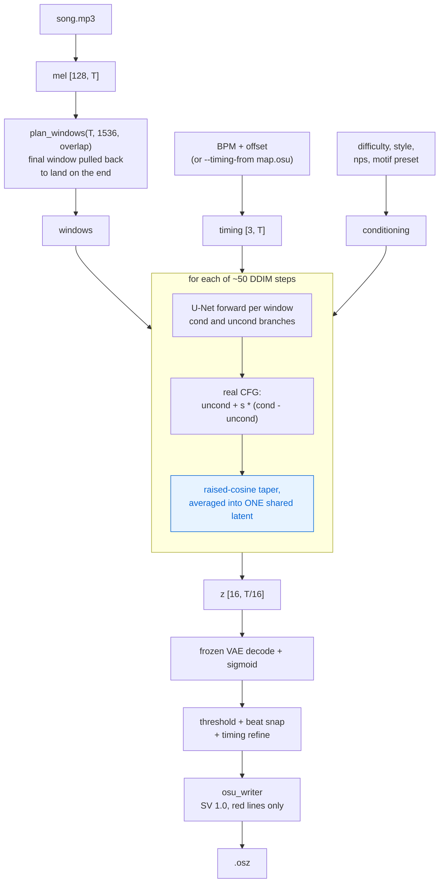

# tAIkoMapper — diagrams

Mermaid views of the pipeline and the model. Numbers are the `p1` profile at
`--window-frames 1536` (30.7 s) unless noted. Source of truth is the code:
`taiko/model/`, `taiko/data/frames.py`, `taiko/model/model_config.py`.

---

## 1. End to end — audio in, `.osz` out

Gate A is a permanent ceiling: whatever the autoencoder loses, no amount of
stage-2 training recovers.

---

## 2. The three tensors, and the one time grid

Timing is an **input, not an output** — tempo is known at generation time, and
sin/cos phase carries the sub-frame precision that 1/4 and 1/6 snaps need.
A pulse train cannot.

---

## 3. Stage 1 — the chart autoencoder (frozen afterwards)

5.33M params. `latent_scale` is a registered buffer, not a config value — a
diffusion model trained against the wrong latent scale fails at every timestep
in a way the loss curve does not show.

---

## 4. Stage 2 — latent diffusion, one training step

The motif vector is measured on the same window the model must generate, so it
is nearly a summary of the answer. Per-dimension dropout is what stops the model
reading the answer off its own conditioning; `evaluate.py --use-reference-motif`
is the leakage probe.

---

## 5. The audio encoder — why it has a strided stem

Max-pooling the flux is the point: a 16x reduction by strided convolution alone
smooths away exactly the transients that decide where notes go. The alternative
— interpolating audio across the resolution gap inside the U-Net — point-samples
most of the onset information into nothing.

---

## 6. Inside the U-Net (`p1`: base 128, mult 1,2,3,4, 2 res blocks/level)

Each level is: concat `[h, audio_lvl, timing]` -> 1x1 proj -> N ResBlocks ->
S4 block (long-range, depthwise conv + SiLU gating) -> down/up. Audio and
timing are re-injected at **every** level rather than added once at the input.

---

## 7. Generation — arbitrary song length

MultiDiffusion, not stitching: overlapping windows denoise **one shared latent**
and are averaged at every step, so there is no seam to blend afterwards. 10 min
= 30,000 frames, under `MAX_FRAMES = 45,000`; cost is linear in length.

Known slow path: `sampling.py` runs those windows sequentially at batch 1, and
CFG as a second separate forward — a 5-min song is ~1,900 batch-1 U-Net
forwards, entirely launch-overhead bound. See work item 6 in `DIRECTION.md`.
